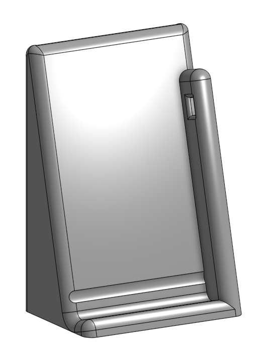
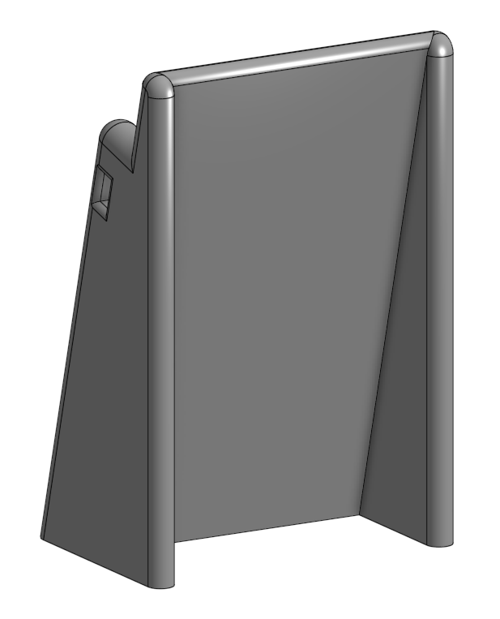

# TI-84 CE Charging Stand
A functional charging stand for a TI-84 Plus CE calculator. Is designed to be 3d printed with a small amount of material (<100g) and very little support material. Also, the design accounts for the rubber nubs on the back of the case, allowing the calculator to be slid into place easily.

